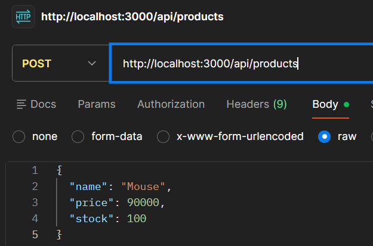
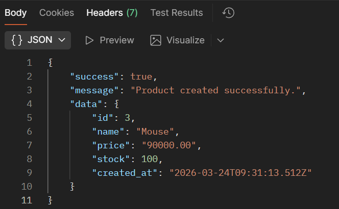
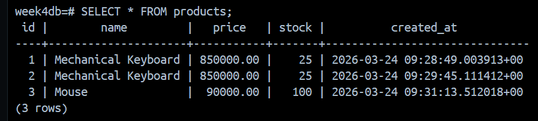

# Week 4 — Simple REST API with Express & PostgreSQL

REST API sederhana dengan satu endpoint POST untuk insert data produk ke database PostgreSQL, dijalankan menggunakan Docker Compose.

---

## Tech Stack

| Layer      | Teknologi            |
|------------|----------------------|
| Runtime    | Node.js 20 (Alpine)  |
| Framework  | Express.js 4         |
| Database   | PostgreSQL 16        |
| DB Driver  | node-postgres (`pg`) |
| Container  | Docker & Docker Compose |
| Config     | dotenv               |

---

## Struktur Direktori

```
week4-api/
├── src/
│   ├── config/
│   │   └── db.js                 # Koneksi & inisialisasi database
│   ├── controllers/
│   │   └── productController.js  # Logika bisnis endpoint
│   └── routes/
│       └── productRoutes.js      # Definisi routing
├── app.js                        # Entry point aplikasi
├── Dockerfile                    # Build image backend
├── docker-compose.yml            # Orkestrasi semua service
├── .env.example                  # Template environment variables
├── .gitignore
├── package.json
└── README.md
```

---

## Cara Menjalankan Aplikasi

### Prasyarat
- [Docker](https://www.docker.com/) & Docker Compose sudah terinstall

### Langkah-langkah

**1. Clone repository**
```bash
git clone <url-repo-kamu>
cd week4-api
```

**2. Buat file `.env` dari template**
```bash
cp .env.example .env
```
Lalu sesuaikan nilai di `.env` sesuai kebutuhan atau biarkan default untuk development

**3. Jalankan semua service**
```bash
docker-compose up -d
```

Docker akan otomatis:
- Pull image PostgreSQL
- Build image backend
- Membuat tabel `products` jika belum ada
- Menjalankan kedua service dalam satu network

**4. Cek status container**
```bash
docker-compose ps
```

**5. Lihat log aplikasi**
```bash
docker-compose logs -f api
```

**6. Hentikan semua service**
```bash
docker-compose down
```

> Untuk menghapus volume database sekaligus: `docker-compose down -v`

---

## API Endpoint

### `POST /api/products`

Menyimpan data produk baru ke database.

**Request**

```
POST http://localhost:3000/api/products
Content-Type: application/json
```

**Request Body**

```json
{
  "name": "Mechanical Keyboard",
  "price": 850000,
  "stock": 25
}
```

| Field   | Type   | Required | Keterangan                    |
|---------|--------|----------|-------------------------------|
| `name`  | string | yes       | Nama produk                   |
| `price` | number | yes      | Harga (non-negatif)           |
| `stock` | number | yes       | Jumlah stok (integer ≥ 0)     |

**Response — `201 Created`**

```json
{
  "success": true,
  "message": "Product created successfully.",
  "data": {
    "id": 1,
    "name": "Mechanical Keyboard",
    "price": "850000.00",
    "stock": 25,
    "created_at": "2025-07-14T08:30:00.000Z"
  }
}
```

**Response — `400 Bad Request`** *(validasi gagal)*

```json
{
  "success": false,
  "message": "Fields 'name', 'price', and 'stock' are required."
}
```

---

## Skema Database

**Tabel: `products`**

| Kolom        | Tipe           | Keterangan                     |
|--------------|----------------|--------------------------------|
| `id`         | SERIAL (PK)    | Auto-increment primary key     |
| `name`       | VARCHAR(255)   | Nama produk                    |
| `price`      | NUMERIC(10,2)  | Harga produk                   |
| `stock`      | INTEGER        | Jumlah stok                    |
| `created_at` | TIMESTAMPTZ    | Waktu insert (auto)            |

---

## Screenshot

### Postman — Response 201 Created



### Data di Tabel Database

---

## Environment Variables

Salin `.env.example` ke `.env` dan isi nilainya:

```env
PORT=3000

DB_HOST=postgres
DB_PORT=5432
DB_USER=your_db_user
DB_PASSWORD=your_db_password
DB_NAME=your_db_name
```
---

## author: Muhammad Rafi

Backend Simple REST API & Docker Compose Setup.
